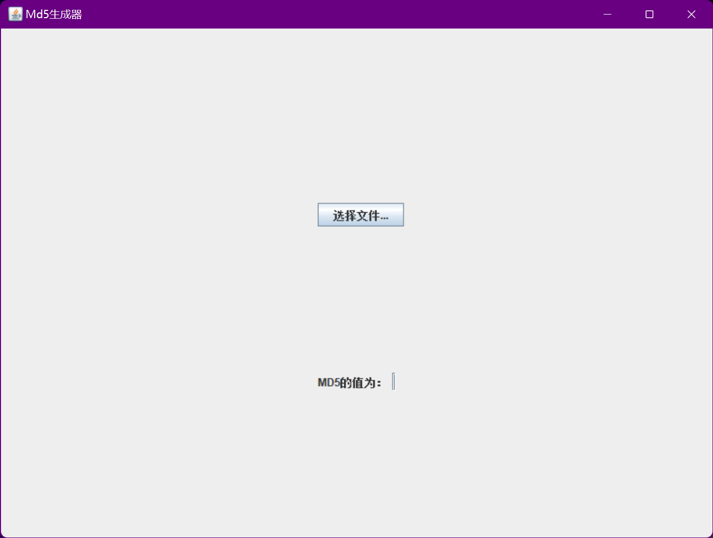
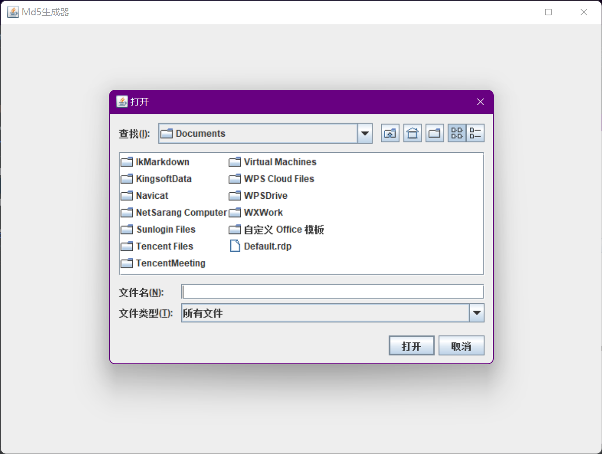
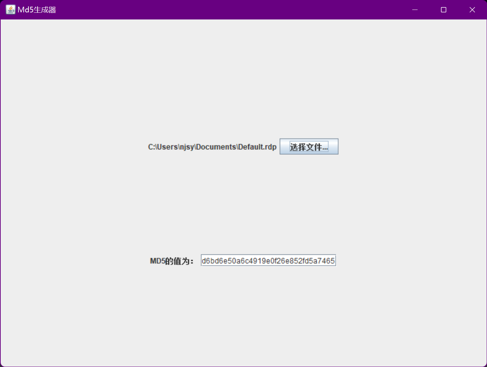

# FileToMD5
使用Java的Swing框架写的一个小工具，可以选择文件并生成文件摘要的MD5值。

# 技术介绍
1. 项目环境：JDK8、Maven

# 目录说明
```shell
├─doc                 // 项目使用到的文档
├─img                 // readme依赖的截图
├─programme           // 可执行的EXE程序
└─swing_generate_md5  // 项目源码
```


# 截图




